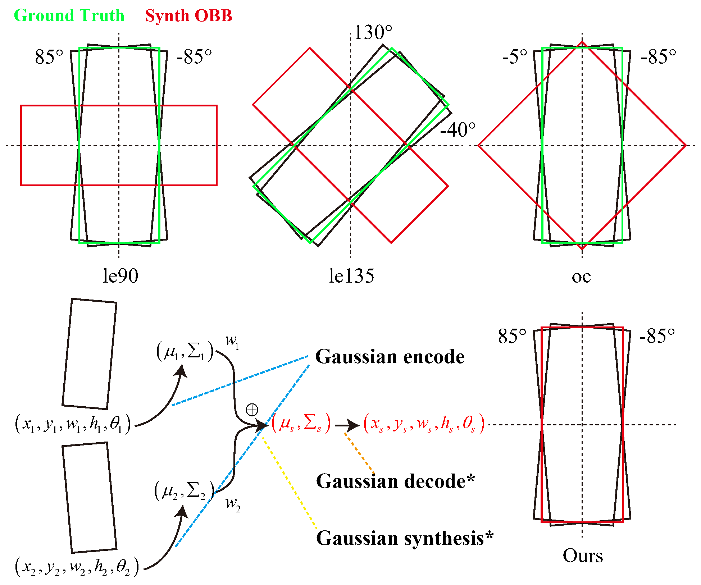

# GauS: Gaussian Synthesis for High-Precision Location in Oriented Object Detection

Tips: the method proposed in this paper is a post-processing method, it can be applied to any NMS-based detectors without addition training step.

The paper is available at: [10.1109/tgrs.2023.3310619](http://dx.doi.org/10.1109/tgrs.2023.3310619)

This implement is based on [mmrotate-1.x](https://github.com/open-mmlab/mmrotate/tree/1.x).

## How to use
Add one code to apply GauS to your detector.

```python
# For one-stage detectors
test_cfg=dict(
        nms_pre=2000,
        min_bbox_size=0,
        score_thr=0.05,
        nms=dict(type='nms_rotated', iou_threshold=0.1),
        max_per_img=2000,
        # GauS
        synth_cfg=dict(synth_thr=0.5, synth_method=2, alpha=1.0, beta=6.0)
)
# For two-stage detectors
test_cfg=dict(
    rcnn=dict(
        nms_pre=2000,
        min_bbox_size=0,
        score_thr=0.05,
        nms=dict(type='nms_rotated', iou_threshold=0.1),
        max_per_img=2000,
        # GauS
        synth_cfg=dict(synth_thr=0.5, synth_method=2, alpha=1.0, beta=6.0)
    )
)
```

If you want to apply it to your own detectors, you should modify the post-process method in your own detection head file. There is a demo in [rotated_retina_head.py](./mmrotate/models/dense_heads/rotated_retina_head.py).

## Use the task list file to simplify the training and testing process

Sometimes we need to test after a training task, which is tedious to do manually. We designed a simple train-test script that processes the tasks listed on the checklist in order. Everything is automated, so you do not need to get up in the middle of the night to check the results or start a new task.

A task list demo is: 
```txt
# configs/GauS/dior/redet-le90_re50_refpn_2x_dior_ms_tta_WBF.py
configs/GauS/dior/redet-le90_re50_refpn_1x_dior_nms.py
```
Symbol `#` means annotation, the script will skip task when meet it.

A train task list demo is:
```shell
python train_task_dota_auto.py task_list_file gpus --single/--multipy --outfile[options]
```
More details in [train_task_dota_auto.py](./train_task_dota_auto.py).


## Citation
```bibtex
@ARTICLE{GauS,
  author={Li, Zhonghua and Hou, Biao and Wu, Zitong and Ren, Bo and Ren, Zhongle and Jiao, Licheng},
  journal={IEEE Transactions on Geoscience and Remote Sensing}, 
  title={Gaussian Synthesis for High-Precision Location in Oriented Object Detection}, 
  year={2023},
  volume={61},
  number={},
  pages={1-12},
  doi={10.1109/TGRS.2023.3310619}
}
```